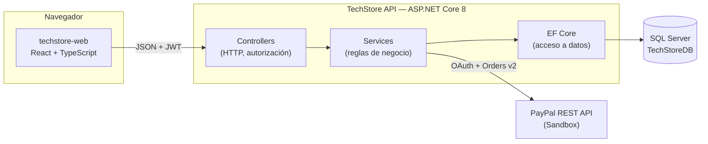
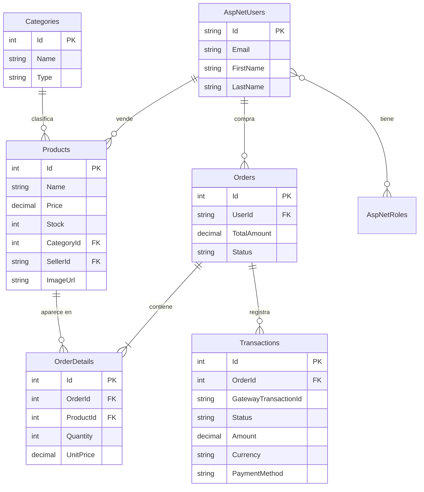
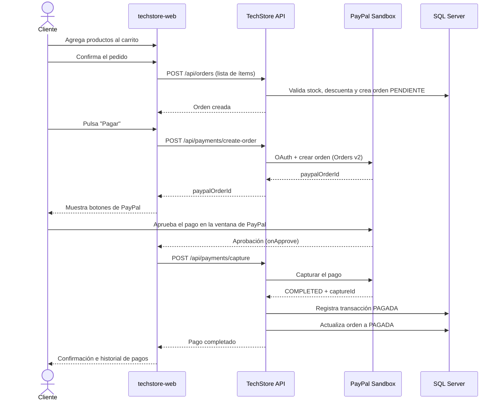

# TechStore API

API REST de una tienda en línea de productos tecnológicos, con autenticación por roles, gestión de catálogo, órdenes de compra y **pago en línea a través de PayPal (Sandbox)**.

Este repositorio contiene el **backend**. La interfaz de usuario vive en un repositorio aparte: [techstore-web](https://github.com/JaredCoto0418/techstore-web).

> Proyecto académico — Universidad Nacional Autónoma de Honduras (UNAH), asignatura *Paradigmas de Programación*, Unidad 3.

---

## Tabla de contenido

1. [Contexto y alcance](#1-contexto-y-alcance)
2. [Arquitectura](#2-arquitectura)
3. [Stack tecnológico y justificación](#3-stack-tecnológico-y-justificación)
4. [Modelo de datos](#4-modelo-de-datos)
5. [Requerimientos funcionales](#5-requerimientos-funcionales)
6. [Requerimientos no funcionales](#6-requerimientos-no-funcionales)
7. [Flujos principales](#7-flujos-principales)
8. [Instalación y ejecución](#8-instalación-y-ejecución)
9. [Referencia de la API](#9-referencia-de-la-api)
10. [Estructura del proyecto](#10-estructura-del-proyecto)
11. [Flujo de trabajo con Git](#11-flujo-de-trabajo-con-git)
12. [Equipo y aportes](#12-equipo-y-aportes)
13. [Estado actual y limitaciones](#13-estado-actual-y-limitaciones)

---

## 1. Contexto y alcance

### Problema

Un comercio de productos tecnológicos necesita vender en línea. Hasta ahora el cobro se hacía por fuera del sistema (transferencia o efectivo contra entrega), lo que obliga a conciliar pagos a mano y no deja registro confiable de qué se cobró y cuándo.

### Objetivo

Construir una tienda web funcional donde un cliente pueda armar un carrito, generar una orden y **pagarla en línea**, dejando registro automático de cada transacción, con un backend que exponga esa funcionalidad como API REST consumible por cualquier cliente.

### Alcance

**Dentro del alcance:**

- Autenticación y autorización por roles (Administrador, Vendedor, Cliente).
- Catálogo de productos con imágenes, categorías e inventario.
- Carrito de varios productos y generación de órdenes con descuento de stock.
- Cobro en línea con PayPal en ambiente **Sandbox**, con confirmación de éxito y de rechazo.
- Registro de transacciones e historial consultable por el cliente y por el administrador.

**Fuera del alcance (decisión consciente):**

- Pagos en producción con dinero real. El proyecto usa exclusivamente el ambiente de pruebas de PayPal.
- Envíos, logística, facturación fiscal y devoluciones.
- Gestión de servicios técnicos. El proyecto arrancó con un módulo de servicios y un rol de Técnico que se retiraron por completo antes de desarrollar las funcionalidades de esta unidad, para concentrar el esfuerzo en el flujo de compra y pago. Ver la sección [Estado actual](#13-estado-actual-y-limitaciones).

---

## 2. Arquitectura

La solución es una **arquitectura cliente–servidor en tres capas físicas**, con una SPA que consume una API REST sin estado, respaldada por una base de datos relacional. El cobro se delega a un proveedor externo.



### Capas internas de la API

| Capa | Responsabilidad | Ejemplo |
|---|---|---|
| **Controllers** | Exponer endpoints HTTP, validar el modelo y aplicar autorización por rol. No contienen lógica de negocio. | `PaymentsController`, `OrdersController` |
| **Services** | Reglas de negocio: validar stock, calcular totales, orquestar el pago, registrar transacciones. | `OrderService`, `PayPalService` |
| **DTOs** | Contratos de entrada y salida. Las entidades de base de datos **nunca** se exponen directamente. | `OrderCreateDto`, `TransactionDto` |
| **Database** | Entidades EF Core y `TiendaDbContext`, con migraciones versionadas. | `PaymentTransactionEntity` |

**Decisiones transversales:**

- **Respuesta uniforme.** Todos los endpoints devuelven `ResponseDto<T>` con `statusCode`, `status`, `message`, `data` y `errors`. El frontend interpreta siempre la misma forma, sin ramificar por endpoint.
- **Inyección de dependencias por interfaz.** Cada servicio se registra contra su interfaz (`IOrderService`, `IPayPalService`), lo que permite sustituir implementaciones — por ejemplo, cambiar PayPal por otra pasarela — sin tocar los controladores.
- **Mapeo automático.** AutoMapper traduce entidad ↔ DTO en un único perfil (`AutoMapperProfiles`), evitando código repetitivo de asignación.
- **API sin estado.** No hay sesión en servidor: cada petición viaja con su JWT. Esto permite escalar horizontalmente y simplifica el despliegue.

---

## 3. Stack tecnológico y justificación

| Componente | Elección | Por qué |
|---|---|---|
| Plataforma | **ASP.NET Core 8 (.NET 8)** | Versión LTS con soporte extendido. Trae de fábrica inyección de dependencias, middleware de autenticación y generación de OpenAPI, sin necesidad de armar el andamiaje a mano. |
| ORM | **Entity Framework Core 8** | Modelo *code-first*: el esquema se deriva de las entidades y queda versionado en migraciones. Elimina SQL repetitivo y da consultas tipadas verificadas por el compilador. |
| Base de datos | **SQL Server 2022** | Ver justificación ampliada abajo. |
| Autenticación | **JWT (Bearer) + ASP.NET Identity** | Identity resuelve hashing de contraseñas, normalización de correos y gestión de roles con calidad de producción. JWT mantiene la API sin estado y es directamente consumible por la SPA. |
| Pasarela de pago | **PayPal REST API — Orders v2 (Sandbox)** | Es la pasarela con mejor cobertura de documentación y un ambiente de pruebas gratuito que no exige cuenta bancaria ni verificación empresarial — requisito indispensable en un proyecto académico. Además ofrece SDK oficial de React, lo que redujo el trabajo de integración en el cliente. |
| Mapeo | **AutoMapper 12** | Centraliza la conversión entidad ↔ DTO en un solo perfil. |
| Documentación | **Swagger / Swashbuckle** | Documentación viva y navegable, generada del propio código, con soporte para probar endpoints autenticados con JWT. |

### Por qué SQL Server y no otro motor

El dominio del problema es **inherentemente relacional y transaccional**: un producto pertenece a una categoría y a un vendedor; una orden agrupa varios detalles; cada detalle referencia un producto; y una transacción pertenece a una orden. Estas relaciones se consultan en conjunto de forma constante.

La decisión se evaluó frente a tres alternativas:

| Alternativa | Por qué se descartó |
|---|---|
| **MongoDB** (documental) | El modelo no es agregable en documentos autocontenidos: productos, órdenes y transacciones se consultan de forma cruzada. Emular las relaciones a mano significaría duplicar datos y perder integridad referencial justo donde más importa — el dinero. |
| **SQLite** | Sirve para desarrollo local, pero no soporta concurrencia real de escritura. El descuento de stock durante la compra es precisamente un escenario de escritura concurrente. |
| **PostgreSQL** | Técnicamente equivalente y perfectamente válido. Se descartó por razones de ecosistema, no de capacidad (ver abajo). |

Se eligió **SQL Server** por cuatro razones concretas:

1. **Integridad transaccional.** El descuento de stock, la creación de la orden y el registro del pago deben ser consistentes. Un motor ACID con llaves foráneas garantiza que no queden órdenes huérfanas ni stock descontado sin venta asociada.
2. **Integración de primera clase con el stack.** El proveedor `Microsoft.EntityFrameworkCore.SqlServer` es el mejor soportado del ecosistema .NET: migraciones, tipos de datos y herramientas funcionan sin adaptadores de terceros.
3. **Tipos decimales exactos.** Los montos se mapean a `decimal(18,2)`, que es aritmética decimal exacta, no punto flotante. En un sistema que maneja dinero esto no es opcional: evita errores de redondeo acumulados.
4. **Disponibilidad para el equipo.** Edición Developer gratuita, imagen oficial de Docker multiplataforma y herramientas maduras (SSMS, Azure Data Studio). Todo el equipo pudo levantar el mismo entorno sin fricción, en Windows y en contenedor.

---

## 4. Modelo de datos



**Notas de diseño:**

- `OrderDetails.UnitPrice` guarda el precio **al momento de la compra**. Si el producto cambia de precio después, las órdenes históricas conservan el valor cobrado.
- `OrderDetails.ProductId` es opcional (`int?`) para que el borrado de un producto no destruya el histórico de órdenes.
- `Transactions.GatewayTransactionId` almacena el *capture id* real devuelto por PayPal, lo que permite conciliar cualquier pago contra el panel de la pasarela.
- Estados de orden: `PENDIENTE` → `PAGADA` | `PAGO_RECHAZADO`. El vendedor puede avanzar el estado logístico de la orden desde su panel.
- Todas las entidades de negocio heredan de `EntidadBase`, que aporta `Id` y campos de auditoría (creación y modificación).

---

## 5. Requerimientos funcionales

| ID | Requerimiento | Criterio de aceptación | Endpoints |
|---|---|---|---|
| RF-01 | Registro y autenticación de usuarios | El usuario se registra y obtiene un JWT válido al iniciar sesión; el token incluye su rol | `POST /api/auth/register`, `POST /api/auth/login` |
| RF-02 | Administración de usuarios y roles | El administrador lista, crea, edita y elimina usuarios y roles; el resto de roles recibe 403 | `/api/users`, `/api/roles` |
| RF-03 | Administración de categorías | El administrador gestiona categorías; administrador y vendedor pueden consultarlas | `/api/categories` |
| RF-04 | Administración de productos con imagen | Vendedor y administrador crean, editan y eliminan productos, con carga opcional de imagen | `/api/products`, `/api/file` |
| RF-05 | Catálogo público | Cualquier visitante consulta el catálogo y el detalle de un producto sin autenticarse | `GET /api/products/catalog`, `GET /api/products/{id}` |
| RF-06 | Orden con varios productos | Una orden acepta N productos distintos; el total es la suma de precio × cantidad de cada ítem | `POST /api/orders` |
| RF-07 | Validación y descuento de stock | Se valida existencia, cantidad mínima y stock de **cada** ítem antes de persistir; si un ítem falla, la orden se rechaza completa | `POST /api/orders` |
| RF-08 | Pago en línea con PayPal | El cliente paga una orden pendiente; la API crea la orden en PayPal y captura el pago aprobado | `POST /api/payments/create-order`, `POST /api/payments/capture` |
| RF-09 | Registro de la transacción | Toda captura — exitosa o rechazada — genera un registro con id de pasarela, monto, moneda y estado, y actualiza el estado de la orden | `POST /api/payments/capture` |
| RF-10 | Historial de transacciones | El cliente consulta sus propios pagos; el administrador consulta todos | `GET /api/transactions/my-transactions`, `GET /api/transactions` |
| RF-11 | Gestión de órdenes | El cliente ve sus órdenes, el administrador todas, y el vendedor actualiza el estado de las que le corresponden | `/api/orders` |
| RF-12 | Autorización por rol | Cada endpoint declara los roles autorizados; el acceso indebido devuelve 403 sin filtrar información | Todos |

### Matriz de permisos

| Recurso | Público | Cliente | Vendedor | Administrador |
|---|:--:|:--:|:--:|:--:|
| Catálogo (lectura) | ✅ | ✅ | ✅ | ✅ |
| Productos (escritura) | — | — | ✅ | ✅ |
| Categorías (escritura) | — | — | — | ✅ |
| Crear orden | — | ✅ | — | — |
| Pagar orden | — | ✅ | — | — |
| Ver transacciones propias | — | ✅ | — | — |
| Ver todas las transacciones | — | — | — | ✅ |
| Cambiar estado de orden | — | — | ✅ | ✅ |
| Usuarios y roles | — | — | — | ✅ |

---

## 6. Requerimientos no funcionales

| ID | Requerimiento | Cómo se cumple |
|---|---|---|
| RNF-01 | **Seguridad de acceso** | Autenticación JWT firmada, autorización declarativa por rol en cada endpoint y contraseñas con hash gestionado por ASP.NET Identity. |
| RNF-02 | **Gestión de secretos** | Credenciales de PayPal y cadena de conexión viven en `appsettings.Development.json`, excluido del control de versiones. El repositorio no contiene secretos. |
| RNF-03 | **Mantenibilidad** | Separación estricta en capas, servicios contra interfaz e inyección de dependencias. Agregar una pasarela nueva implica una implementación de `IPayPalService`, no tocar controladores. |
| RNF-04 | **Consistencia de la interfaz** | Contrato de respuesta único (`ResponseDto<T>`) y códigos HTTP centralizados en `CodigosDeEstadoHttp`. |
| RNF-05 | **Documentación** | Swagger UI generado del código, con autenticación JWT integrada para probar endpoints protegidos. |
| RNF-06 | **Portabilidad y reproducibilidad** | Migraciones EF Core aplicadas automáticamente al arrancar y semilla de datos idempotente: clonar y ejecutar deja el sistema utilizable, sin scripts manuales. |
| RNF-07 | **Integridad de datos monetarios** | Montos en `decimal(18,2)`; el precio unitario se toma siempre del producto en servidor, nunca del cliente. |
| RNF-08 | **Protección de origen cruzado** | CORS restringido a una lista blanca de orígenes configurada por entorno. |
| RNF-09 | **Trazabilidad del trabajo** | GitFlow con ramas por funcionalidad, pull requests revisables y commits individuales por integrante. |
| RNF-10 | **Restricción de moneda** | Las operaciones se manejan en **USD**, porque PayPal no admite el lempira hondureño (HNL) como moneda de transacción. |

---

## 7. Flujos principales

### Compra y pago (flujo completo)



### Manejo del rechazo

Si PayPal no devuelve `COMPLETED`, la API **igualmente registra la transacción**, con estado `PAGO_RECHAZADO`, y marca la orden con ese mismo estado. Se responde 400 con un mensaje explícito. La decisión de dejar rastro también de los pagos fallidos es deliberada: sin ese registro, un rechazo sería invisible para la auditoría.

### Autenticación

1. El cliente envía credenciales a `POST /api/auth/login`.
2. La API valida contra Identity y firma un JWT que incluye el identificador del usuario, su correo y sus roles.
3. El cliente guarda el token y lo envía en `Authorization: Bearer <token>` en cada petición.
4. Cada endpoint verifica el rol requerido antes de ejecutar la acción.

---

## 8. Instalación y ejecución

### Prerrequisitos

| Herramienta | Versión | Notas |
|---|---|---|
| .NET SDK | 8.0 o superior | `dotnet --version` |
| SQL Server | 2019 o superior | Local, Express, LocalDB o en Docker |
| Cuenta de desarrollador de PayPal | — | Gratuita, en [developer.paypal.com](https://developer.paypal.com) |

### Paso 1 — Clonar el repositorio

```bash
git clone https://github.com/JaredCoto0418/techstore-api.git
cd techstore-api
```

### Paso 2 — Levantar la base de datos

**Opción A — SQL Server en Docker** (recomendada, funciona igual en Windows, macOS y Linux):

```bash
docker run -d --name tienda-sqlserver \
  -e "ACCEPT_EULA=Y" \
  -e "MSSQL_SA_PASSWORD=TuPasswordSegura123!" \
  -p 1433:1433 \
  mcr.microsoft.com/mssql/server:2022-latest
```

Si el contenedor ya existe y está detenido, basta con `docker start tienda-sqlserver`.

**Opción B — SQL Server instalado localmente:** solo asegúrate de que el servicio esté corriendo y de poder conectarte con autenticación de Windows.

**No hace falta crear la base de datos ni ejecutar scripts.** La aplicación aplica las migraciones al arrancar y crea `TechStoreDB` si no existe.

### Paso 3 — Configurar el entorno local

Crea el archivo `appsettings.Development.json` en la raíz del proyecto. **Este archivo está en `.gitignore` y nunca debe subirse**, porque contiene credenciales:

```json
{
  "ConnectionStrings": {
    "DefaultConnection": "Server=localhost,1433;Database=TechStoreDB;User Id=sa;Password=TuPasswordSegura123!;TrustServerCertificate=true;MultipleActiveResultSets=true"
  },
  "PayPal": {
    "BaseUrl": "https://api-m.sandbox.paypal.com",
    "ClientId": "TU_CLIENT_ID_DE_SANDBOX",
    "Secret": "TU_SECRET_DE_SANDBOX"
  }
}
```

> Si usas SQL Server local con autenticación de Windows, reemplaza la cadena por:
> `Server=localhost;Database=TechStoreDB;Trusted_Connection=true;TrustServerCertificate=true;MultipleActiveResultSets=true`

### Paso 4 — Obtener las credenciales de PayPal Sandbox

1. Entra a [developer.paypal.com](https://developer.paypal.com) e inicia sesión.
2. Ve a **Apps & Credentials** y asegúrate de estar en la pestaña **Sandbox**.
3. Pulsa **Create App**, dale un nombre (por ejemplo `TechStore`) y créala.
4. Copia el **Client ID** y el **Secret** al `appsettings.Development.json` del paso anterior.
5. En **Testing Tools → Sandbox Accounts** encontrarás una cuenta *personal* con saldo ficticio: son las credenciales con las que iniciarás sesión al momento de pagar. La cuenta *business* es la que recibe el dinero.

> El mismo **Client ID** se usa en el frontend. El **Secret**, en cambio, es exclusivo del backend y no debe salir de él.

### Paso 5 — Ejecutar

```bash
dotnet restore
dotnet run --launch-profile https
```

La API queda disponible en:

| Recurso | URL |
|---|---|
| API | `https://localhost:7066` |
| Swagger UI | `https://localhost:7066` (en la raíz) |
| HTTP alterno | `http://localhost:5182` |

> **Si tienes instalado solo el runtime de .NET 9**, el proyecto (compilado para .NET 8) no arrancará. Ejecuta antes, en la misma terminal:
> ```powershell
> $env:DOTNET_ROLL_FORWARD = "LatestMajor"
> ```

### Paso 6 — Verificar

En el primer arranque la consola muestra las migraciones aplicadas y los datos sembrados. La semilla crea tres usuarios, cinco categorías y seis productos de ejemplo:

| Rol | Correo | Contraseña |
|---|---|---|
| Administrador | `admin@admin.com` | `admin` |
| Vendedor | `vendedor@vendedor.com` | `vendedor` |
| Cliente | `cliente@cliente.com` | `cliente` |

Para comprobar que todo responde, abre Swagger, ejecuta `POST /api/auth/login` con el usuario cliente, copia el token en el botón **Authorize** y consulta `GET /api/products/catalog`.

> Estas credenciales son de desarrollo. En un despliegue real deben cambiarse antes de exponer el servicio.

### Trabajar con migraciones

El esquema se aplica solo al arrancar. Si modificas una entidad:

```bash
dotnet ef migrations add NombreDescriptivo
dotnet run          # la migración se aplica automáticamente
```

Si necesitas partir de cero, elimina la base de datos `TechStoreDB` y vuelve a ejecutar: las migraciones y la semilla la reconstruyen completa.

---

## 9. Referencia de la API

Todas las respuestas siguen el mismo contrato:

```json
{
  "statusCode": 200,
  "status": true,
  "message": "Operación realizada con éxito",
  "data": { },
  "errors": null
}
```

### Autenticación — `/api/auth`

| Método | Ruta | Acceso | Descripción |
|---|---|---|---|
| POST | `/login` | Público | Devuelve el JWT y el correo del usuario |
| POST | `/register` | Público | Registra un usuario nuevo con rol Cliente |

### Productos — `/api/products`

| Método | Ruta | Acceso | Descripción |
|---|---|---|---|
| GET | `/catalog` | Público | Catálogo visible sin autenticación |
| GET | `/{id}` | Público | Detalle de un producto |
| GET | `/` | Admin, Vendedor, Cliente | Listado completo |
| GET | `/my-products` | Vendedor | Productos del vendedor autenticado |
| POST | `/` | Vendedor, Admin | Crea un producto |
| POST | `/with-image` | Vendedor, Admin | Crea un producto con imagen (multipart) |
| PUT | `/{id}` | Vendedor, Admin | Edita un producto |
| PUT | `/{id}/with-image` | Vendedor, Admin | Edita un producto y su imagen |
| DELETE | `/{id}` | Vendedor, Admin | Elimina un producto |

### Categorías — `/api/categories`

| Método | Ruta | Acceso | Descripción |
|---|---|---|---|
| GET | `/products` | Público | Categorías de tipo producto |
| GET | `/` | Admin, Vendedor | Listado completo |
| GET | `/{id}` | Admin, Vendedor | Detalle |
| POST | `/` | Admin | Crea |
| PUT | `/{id}` | Admin | Edita |
| DELETE | `/{id}` | Admin | Elimina |

### Órdenes — `/api/orders`

| Método | Ruta | Acceso | Descripción |
|---|---|---|---|
| GET | `/my-orders` | Cliente, Vendedor | Órdenes propias |
| GET | `/` | Admin | Todas las órdenes |
| GET | `/{id}` | Autenticado | Detalle de una orden |
| POST | `/` | Cliente | Crea una orden con uno o varios productos |
| PUT | `/{id}` | Admin | Edita una orden |
| PUT | `/{id}/status` | Vendedor | Actualiza el estado |
| DELETE | `/{id}` | Admin | Elimina una orden |

### Pagos — `/api/payments`

| Método | Ruta | Acceso | Descripción |
|---|---|---|---|
| POST | `/create-order` | Cliente | Crea la orden de pago en PayPal y devuelve `paypalOrderId` |
| POST | `/capture` | Cliente | Captura el pago aprobado, registra la transacción y actualiza la orden |

Ambos endpoints verifican que la orden pertenezca al cliente autenticado y rechazan el pago de una orden ya pagada.

### Transacciones — `/api/transactions`

| Método | Ruta | Acceso | Descripción |
|---|---|---|---|
| GET | `/my-transactions` | Cliente | Historial de pagos propio |
| GET | `/` | Admin | Todas las transacciones |

### Usuarios y roles — `/api/users`, `/api/roles`

| Método | Ruta | Acceso | Descripción |
|---|---|---|---|
| GET | `/api/users` | Admin | Listado con búsqueda y paginación |
| GET | `/api/users/{id}` | Admin | Detalle |
| POST | `/api/users` | Admin | Crea usuario |
| PUT | `/api/users/{id}` | Admin | Edita usuario |
| DELETE | `/api/users/{id}` | Admin | Elimina usuario |
| GET | `/api/users/sellers` | Admin, Vendedor | Lista de vendedores |
| GET · POST · PUT · DELETE | `/api/roles` | Admin | CRUD de roles |

### Archivos — `/api/file`

| Método | Ruta | Acceso | Descripción |
|---|---|---|---|
| POST | `/upload-product-image/{productId}` | Admin, Vendedor | Sube la imagen de un producto |
| DELETE | `/delete-product-image` | Admin, Vendedor | Elimina una imagen por URL |

Las imágenes se guardan en `wwwroot/images/products` y se sirven como archivos estáticos.

---

## 10. Estructura del proyecto

```
techstore-api/
├── Constants/           Códigos de estado HTTP y nombres de roles
├── Controllers/         Endpoints HTTP (uno por recurso)
├── Database/
│   ├── Entities/        Entidades EF Core
│   └── TiendaDbContext  Configuración del modelo y relaciones
├── Dtos/                Contratos de entrada y salida, por dominio
├── Extensions/          Configuración de CORS y autenticación
├── Filters/             Validación automática del ModelState
├── Helpers/             Perfiles de AutoMapper
├── Migrations/          Historial versionado del esquema
├── Services/
│   ├── Interfaces/      Contratos de los servicios
│   ├── OrderService     Órdenes: validación de stock y totales
│   ├── PayPalService    Integración con la API REST de PayPal
│   ├── TransactionService  Registro y consulta de pagos
│   └── DataInitializationService  Semilla de roles, usuarios y productos
├── wwwroot/images/      Imágenes de productos servidas estáticamente
└── Program.cs           Composición de la aplicación
```

---

## 11. Flujo de trabajo con Git

El equipo trabajó con **GitFlow simplificado**:

```
main         ← solo versiones integradas y probadas
 └── develop ← integración continua del equipo
      ├── feat/transacciones
      ├── feat/pasarela-paypal
      ├── feat/carrito
      └── chore/seed-productos
```

Reglas que seguimos:

- Una rama por funcionalidad, nombrada con el prefijo del tipo de cambio (`feat/`, `refactor/`, `chore/`).
- Ningún cambio entra directo a `develop` ni a `main`: **todo pasa por pull request**.
- Cada integrante commitea con su propia cuenta, de modo que la autoría del trabajo queda registrada en el historial.
- Mensajes de commit en formato convencional: `tipo(alcance): descripción en imperativo`.
- El trabajo se dividió en **cortes verticales**: cada integrante desarrolló su funcionalidad completa, de la base de datos a la interfaz, en ambos repositorios.

---

## 12. Equipo y aportes

El reparto se hizo por funcionalidad completa, respetando la dependencia entre ellas: las transacciones se entregaron primero porque el registro del pago las necesita.

| Integrante | Cuenta | Funcionalidad | Aporte en este repositorio | PR |
|---|---|---|---|---|
| Jossué Alvarado | [@OsvinAlvarado](https://github.com/OsvinAlvarado) | **Transacciones e historial** | Entidad `PaymentTransaction`, `TransactionService`, `TransactionsController` con historial para cliente y administrador, mapeos y migración del esquema. Se cambió la creación de base de datos por migraciones versionadas. | [#3](https://github.com/JaredCoto0418/techstore-api/pull/3) |
| Jared Coto | [@JaredCoto0418](https://github.com/JaredCoto0418) | **Pasarela de pago** | `PayPalService` sobre la API Orders v2 (token OAuth, creación y captura), `PaymentsController`, validación de propiedad de la orden, registro de la transacción y actualización del estado. | [#4](https://github.com/JaredCoto0418/techstore-api/pull/4) |
| Camilo Alvarado | [@Reycamilo](https://github.com/Reycamilo) | **Carrito multi-producto** | `OrderService.CreateAsync` reescrito para aceptar N ítems: validación de producto, cantidad y stock por ítem, descuento de inventario y cálculo del total en servidor. Además, la semilla de productos de ejemplo. | [#5](https://github.com/JaredCoto0418/techstore-api/pull/5), [#6](https://github.com/JaredCoto0418/techstore-api/pull/6) |

El proyecto base — autenticación, usuarios, roles, categorías, productos y órdenes de un solo ítem — se construyó de forma conjunta antes de este reparto ([#1](https://github.com/JaredCoto0418/techstore-api/pull/1), [#2](https://github.com/JaredCoto0418/techstore-api/pull/2)).

Los aportes de cada integrante en la interfaz de usuario están documentados en el [README de techstore-web](https://github.com/JaredCoto0418/techstore-web#12-equipo-y-aportes).

---

## 13. Estado actual y limitaciones

**Funciona y está probado de punta a punta:** registro e inicio de sesión, catálogo, administración de productos y categorías, carrito de varios productos, creación de orden con descuento de stock, pago con PayPal Sandbox — incluyendo captura real con `captureId` de la pasarela — registro de la transacción e historial.

**Limitaciones conocidas, asumidas conscientemente:**

- **Solo ambiente Sandbox.** Pasar a producción requiere credenciales *live* de PayPal y una cuenta empresarial verificada. El código no cambia; sí la configuración y la URL base.
- **Moneda fija en USD.** PayPal no admite HNL como moneda de transacción. Vender en lempiras exigiría una conversión y mostrar ambos montos.
- **Sin webhook de PayPal.** La confirmación depende de que el navegador complete la llamada de captura. Un webhook haría el sistema resistente a que el usuario cierre la ventana justo después de aprobar el pago.
- **`Type` en categorías.** El campo conserva el valor `"Product"` por compatibilidad con el esquema original, cuando el sistema también manejaba servicios. Hoy todas las categorías son de producto.
- **Sin pruebas automatizadas.** La verificación fue manual, guiada por los criterios de aceptación de cada requerimiento. Es la primera deuda técnica a saldar si el proyecto continúa.

---

## Licencia

Proyecto desarrollado con fines académicos para la Universidad Nacional Autónoma de Honduras. El código puede consultarse y reutilizarse con fines educativos.
